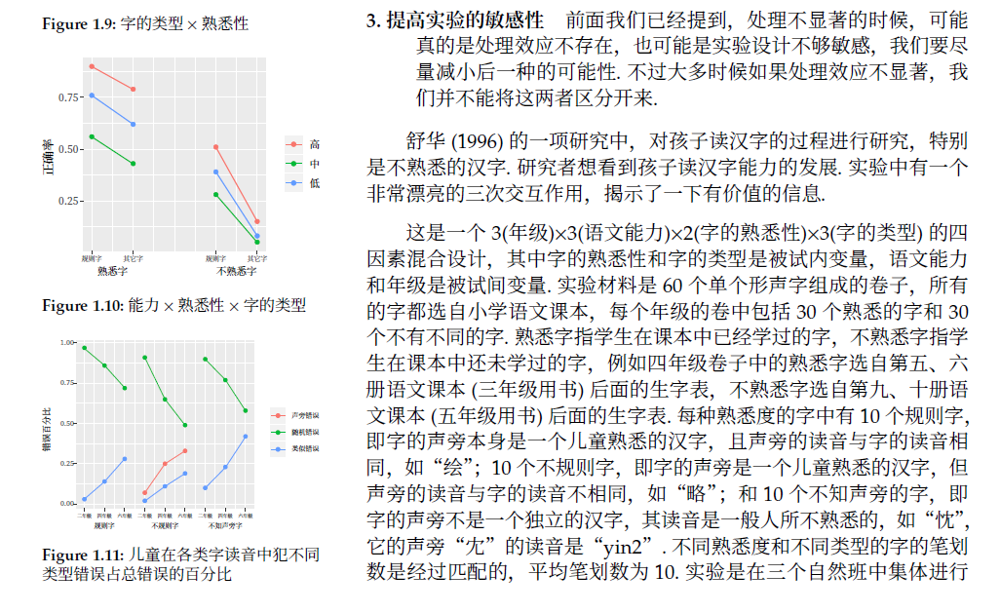
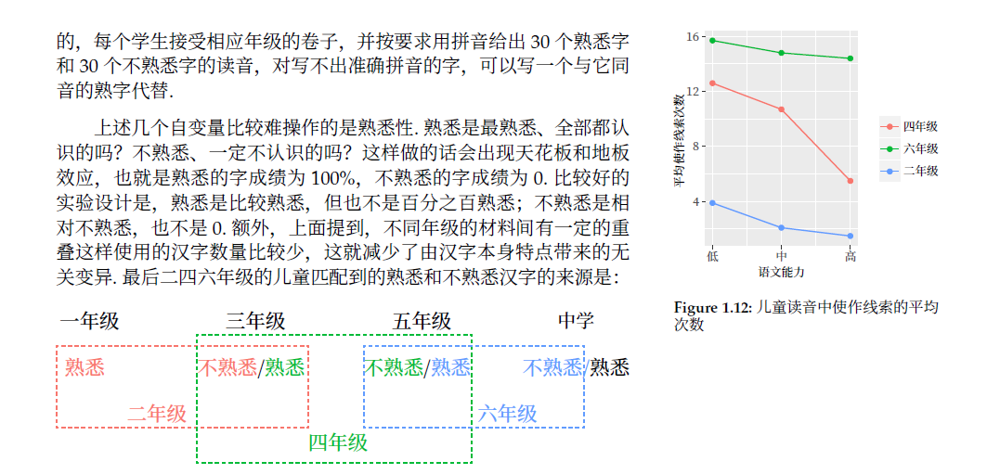

# 多因素实验设计重写

## 提要

本项目为我个人兴起，想重写舒华老师的**《心理与教育研究中的多因素实验设计》**，主要解决以下问题：

1. 例子不够多，我于第一章中加入舒老师上课报告的文献以及我自己觉得比较好的实验；

   

   

   

2. 公式比较丑，故重写（我现在的latex公式里面$\sum$的显示也还有点问题(。・∀・)ノ）；

3. 数据表有些许错误，改之；

4. 数据表不够直观，改用彩色显示，下图是个例子，$[Y],[AS],[A]$的颜色和取用数据的数据表区域用了统一颜色

5. 第二编的软件是SPSS，欲改成R

## 欢迎您的加入

如果您也有想法重新制作这本书籍，请与我[邮件](mailto:yusaisaisai@gmail.com)联系，在联系前请确保您具有：

1. 基本latex知识
2. 基本R/gglot2知识
3. git版本管理知识
4. 矢量图绘制与修改
5. 基本的认知心理学知识
6. 基本的数理统计知识
7. 耐心与努力